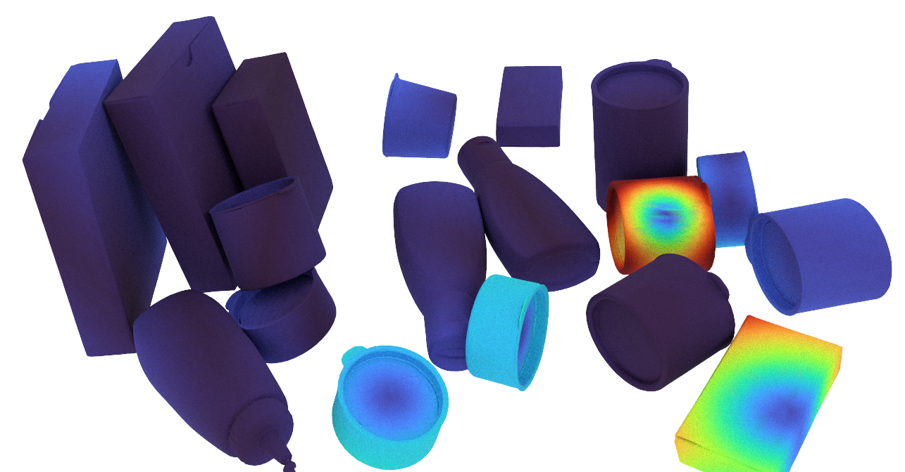

# Heatmap error distance 



This is the code that was used to generate the heatmap results for [Diff-DOPE](https://arxiv.org/abs/2310.00463). If you are using BOP annotation you should be able to use the code. There is an example folder that is self contained. 

```
python heatmap.py --opencv --bop --overlay --path_json_gt example/scene_gt.json --path_json_gu example/diff_dope.json --objs_folder example/models/ --contour --spp 100
```

This should produce the image above. Run with `--raw` for a faster generation
